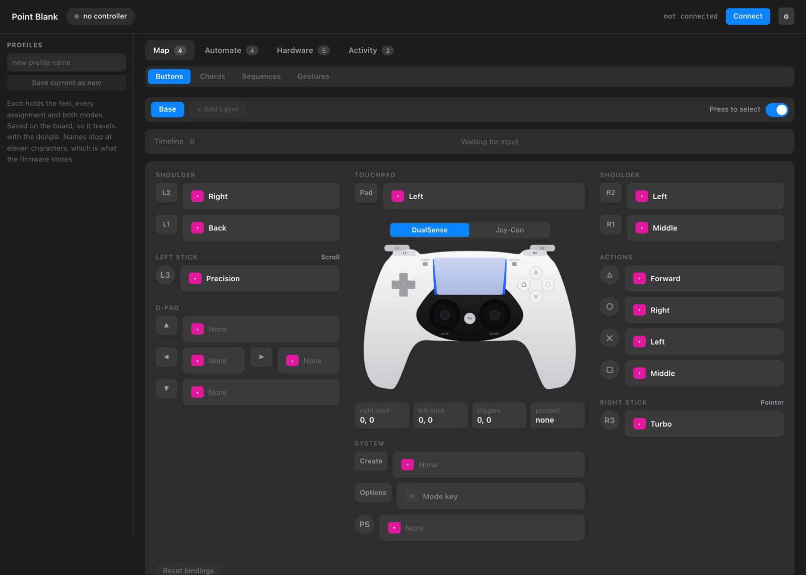

# treadmill-mouse

A USB dongle that turns a Bluetooth game controller into an ordinary mouse.

Plug it into a computer and the computer sees a mouse. Not a gamepad with a
driver, not an app that maps buttons to clicks — a mouse, the same kind of
device a wireless mouse's own receiver presents. There is nothing to install,
no permission to grant, no Bluetooth pairing to do on the host, and no account
anywhere. The controller pairs to the dongle, once, and after that the pair
travels together to any machine with a USB port.

It exists because of a treadmill. Walking at 2 mph, a desk mouse is useless —
there is no flat surface that stays still, and a trackpad needs a hand planted
somewhere. A game controller is the one pointing device already designed to be
held in mid-air by someone whose body is moving. Everything else here followed
from wanting a cursor while walking, on whatever computer happened to be in
front of the treadmill.

That is also why it works on a work computer. No driver, no installer, no
admin password, no accessibility permission, nothing for IT to approve —
every operating system has shipped support for a USB mouse for thirty years,
and this is a USB mouse. A managed laptop that would block a mapping app the
moment you tried to run it treats this the same way it treats the mouse
already on the desk. It has been plugged into one and it worked.

The one prompt you may see is macOS's own "Allow accessory to connect?", which
Apple Silicon shows for any new USB device and no firmware can suppress. It is
a single click and needs no password. Turning on the mouse-only identity below
gets rid of the other one.

The firmware is a patched build of [joypad-os](https://github.com/joypad-ai/joypad-os),
running on a Raspberry Pi Pico 2 W. This repository holds the changes, the
configuration page, and the test tools.

## What you need

A Raspberry Pi Pico 2 W (about $7), a USB cable, and a Bluetooth controller.
No soldering, no case required, no other parts.

## Controllers it works with

The mouse layer sits above the Bluetooth drivers. It reads the normalised input
event, not any particular pad's report, so anything joypad-os can talk to can
drive the cursor.

| | |
|---|---|
| Sony | DualShock 3, DualShock 4, DualSense |
| Nintendo | Switch Pro and first-generation Joy-Con over Classic; Switch 2, Joy-Con 2 and the GameCube NSO pad over BLE; Wii U Pro; Wiimote |
| Google | Stadia |
| Microsoft | every Xbox variant, through the generic driver |
| Augmental | MouthPad, a mouth-operated BLE pointing device |
| Anything else | any standard Bluetooth HID gamepad, through the generic driver |

Xbox pads deliberately have no dedicated driver. The generic driver reads the
HID descriptor and works out the layout from it, the way BlueRetro does, which
covers every variant without anyone having to guess at a report format.

**Only the DualSense has actually been tested.** That table is a list of drivers
compiled into the build, not a list of things known to work. A first-generation
Joy-Con is wired up for motion here too and has never met real hardware — see
[docs/JOYCON.md](docs/JOYCON.md).

Two features are narrower than the table. The touchpad needs a pad that has one,
so DualShock 4 or DualSense. The gyro needs an inertial sensor: DualShock 4 and
DualSense, the DualShock 3 on one axis only, and Joy-Con through the patch in
this repo. The buzz that confirms a chord needs a pad with rumble.

Valve's Steam Controller and the iPega PG-9021 landed upstream after the commit
this is pinned to, so they are not in the published build. Moving the pin in
`setup.sh` picks them up.

## Getting it running

Download `joypad-puremouse-v20.uf2` from the
[latest release](../../releases/latest).

Hold the BOOTSEL button on the Pico while plugging it in. It appears as a USB
drive called RP2350. Drag the `.uf2` onto that drive; the board reboots on its
own. If it comes back with a fast-blinking light and no USB device, the copy was
truncated — see [docs/BUILDING.md](docs/BUILDING.md) for the verified way.

Then pair the controller to the dongle: on a DualSense, hold CREATE and PS
together for about five seconds, until the light bar double-blinks. Press the
button on the Pico if the dongle is not already looking for a pad.

Out of the box the dongle boots in gamepad mode. Double-click the button on the
board to step to the next USB output mode; five double-clicks reaches
Keyboard/Mouse, and the mode is saved, so it only has to be done once. There is
no computer involved in that. Everything else is in
[docs/CONTROLS.md](docs/CONTROLS.md).

## What the controls do

```
Right stick    cursor
Left stick     scroll, vertical and horizontal

R2 / Cross     left click
L2 / Circle    right click
R1 / Square    middle click
L1             back              Triangle    forward

L3 (hold)      precision, 30% speed
R3 (hold)      turbo, 250% speed
```

Every assignment is configurable, and there are eight presets stored on the
dongle itself. The touchpad can act as a trackpad, both sticks can point at
once for placement neither reaches alone, a trigger can be an analog speed
dial, and the gyro can steer the cursor with a mode that finds gravity so the
angle you hold the pad at stops mattering — which is the mode that suits a
treadmill.

Nothing in the map can produce a keystroke. The value type in the mapping table
is a mouse button; there is no row shape that could emit a key even by mistake.
That is deliberate: it is what makes the thing safe to plug into a machine you
do not administer.

## Configuring it



`config.html` — it calls itself Point Blank — is a single file. Open it in
Chrome or Edge, press Connect, pick the serial port. It talks to the dongle
over Web Serial, so it works from `file://` with no server, no build step and
no network, and nothing is sent anywhere. Settings apply on the next report and
save to the dongle's own flash, so they travel with it.

Press a button on the controller and the page selects that control's card, so
you never have to work out what the firmware calls the thing under your thumb.

The same settings are reachable from a terminal. The tools need pyserial
(`pip install pyserial`) and nothing else:

```
./tools/mouse.py                 show everything
./tools/mouse.py speed 2400      pointer pixels/sec at full deflection
./tools/mouse.py scroll 25       scroll ticks/sec
./tools/mouse.py precision 30    speed % while L3 is held
./tools/mouse.py cal             relearn stick centre, sticks released
./tools/mouse.py save            persist
```

## Mouse-only identity

By default the dongle enumerates as a composite device that declares a keyboard
interface it never writes to. On macOS that makes Keyboard Setup Assistant open
on first plug and ask you to press the key next to left Shift, which does not
exist.

Turning on the mouse-only identity replaces that with a single HID interface
carrying the mouse report descriptor, plus the serial port used for tuning. No
keyboard, no gamepad. It is a stored setting rather than a separate build:

```
./tools/jp.py MOUSE.PURE on=1
```

or the "What the machine sees" panel in `config.html`. It takes effect after a
reboot, because identity is declared at enumeration time.

## What has actually been tested

On macOS, by hand and by instrument: the cursor on all four axes with zero
cross-axis leakage, scroll in both directions, clicks, and no drift at all with
the deadzone set to zero. Through the real controller that came to 49,000 px of
cursor travel, 743 scroll events and 15 clean clicks, with cursor movement
attributed only to samples where the stick was measurably deflected — cursor
travel on its own cannot tell a dongle from a hand on the trackpad. Settings
survive a power cycle. It has been plugged into a managed machine with no admin
rights and worked there with nothing installed.

Not tested: Windows and Linux. It is a plain HID mouse with a standard report
descriptor, so there is every reason to expect it to work and no evidence that
it does. The touchpad, both-sticks-pointing, speed dial, gyro and chord modes
are built and reachable but have not been through the same instrumented test as
the pointer. The gyro axis signs are reasoned rather than observed, so expect at
least one to need flipping; there are invert switches for exactly that.

`tools/selftest.py` proves the pointer, scroll and click path reaches the host
with no controller attached at all, by driving the report path from firmware.
It is macOS-only, because it reads Quartz event counters to confirm what
arrived.

## What you could mod it into

The scope here is deliberate. Mouse and nothing else is not a limitation that
ran out of time — it is the property the whole thing rests on, and every
tempting addition costs it.

Keyboard shortcuts are the obvious next surface, and they are the one thing that
would undo this. The firmware currently never writes a keystroke, but that is
behaviour; what a host inspects is identity. Declare a keyboard interface and
endpoint security sees a keyboard on a machine you do not administer, and macOS
opens Keyboard Setup Assistant asking for a key that does not exist. The
mouse-only identity above exists precisely to stop declaring one. If you do not
care about locked-down machines, the mapping table is the place to start: the
action enum in `kbmouse.h` has fourteen values and all of them are pointer
actions, so adding a keycode type is a day's work, not an architecture change.

Siri, Spotlight and media keys are the interesting middle case. They are
consumer-control usages, a different HID collection from a keyboard, so they may
not carry the same cost. Nobody has tested that. Two things would need
answering: whether macOS actually maps any consumer usage to Siri or Spotlight,
and whether declaring a second collection re-triggers the host behaviour the
mouse-only identity was built to avoid. Both are answerable in an afternoon with
the board in hand.

Screen zoom and desktop gestures were considered and rejected outright. Both
need keyboard output, and both need per-machine settings that do not travel with
the dongle, which is the opposite of what this is for.

Everything else is open. The mapping table, the presets, the chord handler and
the serial command set are all small and all in `overlay/`.

## Building it

The overlay is the sixteen files this project changes or adds, at the paths
upstream uses. `./setup.sh` clones joypad-os at the pinned commit and copies
them in, which leaves a tree you can `git diff` to see exactly what is
different. Full instructions in [docs/BUILDING.md](docs/BUILDING.md).

## How it works, and why it had to be a firmware change

[docs/DESIGN.md](docs/DESIGN.md) is the long version: the upstream report-format
bug that made the stock mouse mode unusable, why the cursor is driven by
velocity integrated over real elapsed time rather than a fixed delta per report,
how the stick centre is learned continuously instead of hidden behind a
deadzone, and what macOS does to HID pointer deltas on the way in.

## Licence

Apache 2.0, the same as joypad-os, which this is a derivative of. See
[LICENSE](LICENSE) and [NOTICE](NOTICE).

"Joypad" is a trademark of Robert Dale Smith. This project is not affiliated
with or endorsed by the joypad-os project, and does not use the name as its own
branding.
